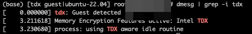

# Path Doubly Oblivious RAM Compatible with Confidential Virtual Machines

A simplified implementation of [EnigMap](https://github.com/odslib/EnigMap) designed for compatibility with confidential virtual machines.

# Setup TDX

Setting up a TDX environment requires a combination of hardware and software:

- Intel's Sapphire Rapids (SPR) CPU
- Host OS kernel and guest OS kernel
- Virtualization components such as Qemu, OVMF, and Kata.

Adapting these components is somewhat challenging. One may follow the instructions in [Intel TDX Tools](https://github.com/intel/tdx-tools) and [Intel TDX](https://github.com/canonical/tdx) to setup the envorinment. While it is fortunate that cloud computing providers are gradually offering confidential computing services, which alleviates the need for the adaptation processes. Moreover, we provide our 64-core, 256GB trusted virtual machine startup script and host-side verification script to assist in the initialization and verification of the TEE environment.

The specific commands that we utilized are as follows.

1. Check your host environment.

```bash
./25.tdx_host_check.sh
```

The output should include

```
[   22.593272] tdx: TDX module initialized.
```

2. Build your `demo.raw` by following [this blog](https://blog.programster.org/create-ubuntu-20-kvm-guest-from-cloud-image). Start your TD VM by

```bash
./start.sh
```

4. Check the memory encryption is active like the screenshot below, which means TD VM has benn successfully setup.



## Compile

If you choose to prepare your own VM image in [step 2](#prep), you need to pull and compile our project by

```bash
git clone https://github.com/55199789/PathORAM.git
cd PathORAM
bash ./setup.sh
mkdir build && cd build
cmake .. && make -j
```

Otherwise, you can simply login to the VM and enter the directory ``~/H2O2RAM``.

## Benchmark

Note that the full benchmark takes a lot of time, and it will fail if the running TDX has limited private memory.

```bash
../bin/ORAMBenchmark --benchmark_repetitions=10
```

Instead, we recommend to run the Python scripts that will save experimental results one by one:cd benchmarks

```bash
cd benchmarks
python3 exp.py &
```
